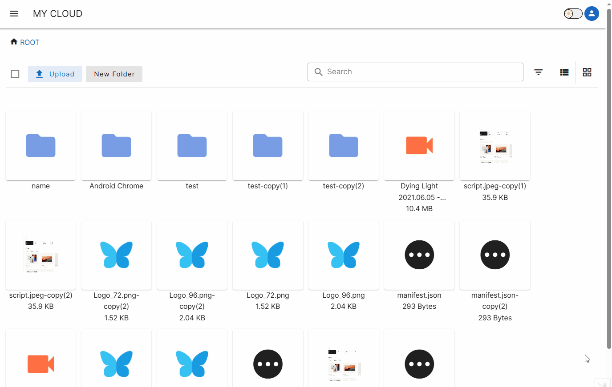

# Navi Cloud

# 주요기능

## Gif
## Gif 용량이 커서 시간이 좀 걸립니다. !!!!!

- 폴더, 파일 , 드래그 파일업로드 ( 버퍼형태로 서버 DB에 저장 )

- 같은 폴더내에 같은 이름의 파일은 서버에서 확인후 -copy(n)으로 이름 변경후 저장

- 각 파일클릭시 image, audio, video 미리보기 제공

- 체크박스 클릭된 파일과 폴더(폴더내부에 모든 폴더와 파일) 다운로드 혹은 삭제 기능

- 이름과 동일한 text 검색기능 

- 로딩 처리 

- 디렉토리에 따른 빠른이동 지원 

- 다운로드, 업로드 진행바와 간략한 정보 표시 모달창 

- 다크 모드 지원 

- 로그인시 , 비로그인시 리디렉션 지원 

- 업로드 버튼옆 현재 디렉터리부터 하위의 모든 파일들 체크 기능 

- 폴더를 체크하면 하위에 모든 파일과 폴더를 체크한 상태 

- pinia를 통한 체크박스 업데이트 훅 최적화 

- JWT토큰을 사용한 로그인
  - access토큰과 , refresh토큰을 사용 localStorage에있는 토큰을 헤더에 담고 해당 토큰의 인증을 성공적으로 마친후에야 접근가능 
  - 만약 access토큰이 만료되면 다른 axios인스턴스를 통해 refresh토큰을 전송하고 DB와의 일치를 판단해 새로운 access토큰을 재발급해줌 
  - 물론 각토큰 변조시 거부함 

## 다크모드

## 파일 액션 

## 좋은거 
keep-alive , suspense 
vue 빌트인 컴포넌트 중에서 애매모호했던거 확실하게 알게된 계기가 된거같다.
로딩처리 같은 예외의 중요성을 알게됨, 해당 처리를 최대한 범용적으로 처리 했다.
components/StatefulRenderer.vue

## 아쉬운거
- 삭제 쿼리가 너무 오래 걸리고 그것을 front에서 끝까지 기다리지 않음 파일과 폴더를 잔뜩 추가해놓고 전체 체크를 하고 삭제를 하면 많은 파일이 있는 폴더는 한번에 사라지지않는걸 확인할수있다 

- 2~3M정도 되는 파일들이 여러개면 약간 불편한 끊김이 생긴다. 

- backend 그냥 예상으로 관계도 많들었더니 너무 많이 바뀌어서 사용하지 못하는 컬럼도 꽤 있다 특히 A , B 라는 폴더밑에 C라는 파일이 생길수도 있다 라는 것을 해당 기능을 많들때 알게되어서 시작부터 꼬인감이 있다. 관계설정을 했지만 마지막에는 유의미하게 사용하지는 않는다.